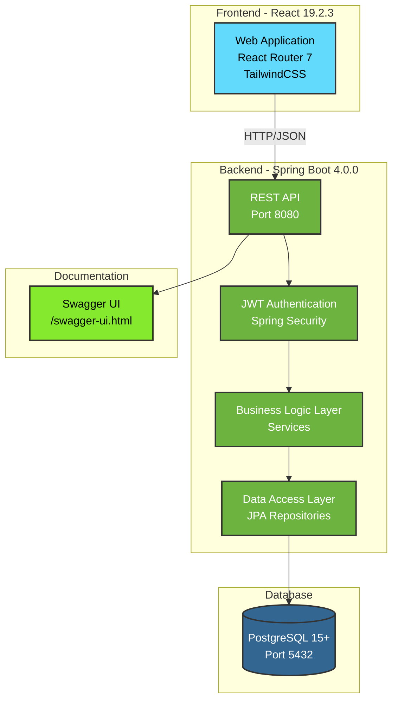
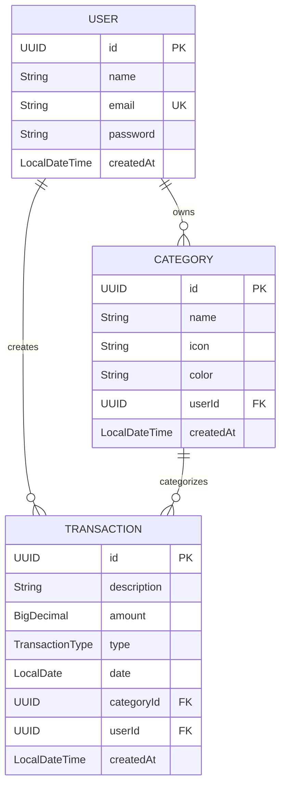

# Penny API - Personal Finance Manager

<!-- Language toggles -->
[](README.md)
[](README.en.md)

<!-- Badges -->


## 📖 About the Project

Penny API is a full-stack application for personal finance management, allowing users to control income, expenses, and categories securely and intuitively.

## ✨ Features

- 🔐 JWT authentication and authorization
- 👤 User registration and management
- 📁 Complete CRUD for custom categories
  - Customizable icons and colors
  - User-scoped isolation
- 💰 Financial transaction management
  - Types: Income and Expenses
  - Pagination and filtering
  - Category association
- 📊 Financial dashboard
  - Total income
  - Total expenses
  - Current balance
- 🛡️ Global exception handling
- 📚 Interactive Swagger documentation
- ✅ Automated tests (unit and integration)
- 📈 80% code coverage

## 🛠️ Tech Stack

### Backend
- **Java 21** - Programming language
- **Spring Boot 4.0.0** - Main framework
  - Spring Web MVC - REST API
  - Spring Data JPA - Data persistence
  - Spring Security - Authentication and authorization
- **PostgreSQL 15+** - Relational database
- **Auth0 java-jwt 4.4.0** - JWT tokens
- **Gradle 9.2.1** - Build tool

### Frontend
- **React 19.2.3** - UI library
- **React Router 7.10.1** - Routing
- **TypeScript 5.9.2** - Type safety
- **TailwindCSS 4.1.13** - CSS framework
- **Vite 7.1.7** - Build tool

### Testing & Quality
- **JUnit 5** - Testing framework
- **TestContainers 1.20.4** - Integration testing
- **JaCoCo** - Code coverage (80% minimum)

### Documentation
- **SpringDoc OpenAPI 3.0.0** - API documentation
- **Swagger UI** - Interactive interface

## 🏗️ Architecture



## 📊 Data Model



## 📋 Prerequisites

Before you begin, ensure you have the following installed:

- **Java 21** - [Download OpenJDK 21](https://adoptium.net/)
- **PostgreSQL 15+** - [Download PostgreSQL](https://www.postgresql.org/download/)
- **Node.js 18+** and **npm** - [Download Node.js](https://nodejs.org/)
- **Git** - [Download Git](https://git-scm.com/)

### Verifying Installations

```bash
java -version    # Should show Java 21
psql --version   # Should show PostgreSQL 15+
node -version    # Should show Node.js 18+
npm -version     # Verifies npm installation
```

## 🚀 Installation

### 1. Clone the Repository

```bash
git clone https://github.com/vittordeaguiar/penny-api.git
cd penny-api
```

### 2. Database Setup

```bash
# Access PostgreSQL
psql -U postgres

# Create the database
CREATE DATABASE penny_db;

# Create a user (optional)
CREATE USER penny_user WITH PASSWORD 'your_password';
GRANT ALL PRIVILEGES ON DATABASE penny_db TO penny_user;

# Exit PostgreSQL
\q
```

### 3. Backend Setup

```bash
# Navigate to API directory
cd api

# Configure environment variables (optional)
export JWT_SECRET="your-secret-key-here"
export JWT_EXPIRATION=3600000

# If you created a specific user, update application.properties:
# src/main/resources/application.properties
# spring.datasource.username=penny_user
# spring.datasource.password=your_password

# Run tests to verify setup
./gradlew test

# Build the project
./gradlew build
```

### 4. Frontend Setup

```bash
# Navigate to web directory
cd ../web

# Install dependencies
npm install
```

## ▶️ Running the Application

### Backend (API)

```bash
# From project root directory
cd api
./gradlew bootRun
```

The API will be available at: `http://localhost:8080`

### Frontend (Web)

In a new terminal:

```bash
# From project root directory
cd web
npm run dev
```

The web application will be available at: `http://localhost:5173`

### Accessing the Application

- **Web Application**: http://localhost:5173
- **REST API**: http://localhost:8080
- **Swagger Documentation**: http://localhost:8080/swagger-ui.html
- **API Docs (JSON)**: http://localhost:8080/v3/api-docs

### First Run

1. Access http://localhost:5173
2. Create a new account via registration
3. Login with your credentials
4. Start managing your finances!

## 🧪 Running Tests

The project has a complete test suite with **80% minimum coverage**.

### Unit and Integration Tests

```bash
# From api directory
cd api

# Run all tests
./gradlew test

# Run unit tests only
./gradlew test --tests "com.vittor.pennyapi.service.*"

# Run integration tests only
./gradlew test --tests "com.vittor.pennyapi.integration.*"
```

### Coverage Report

```bash
# Generate JaCoCo report
./gradlew jacocoTestReport

# The HTML report will be generated at:
# build/jacocoHtml/index.html
```

### Coverage Verification

```bash
# Verify coverage meets minimum requirements (80%)
./gradlew jacocoTestCoverageVerification
```

### Test Structure

```
api/src/test/java/com/vittor/pennyapi/
├── integration/          # 6 integration tests (TestContainers)
│   ├── AuthenticationIntegrationTest.java
│   ├── CategoryIntegrationTest.java
│   ├── TransactionValidationIntegrationTest.java
│   ├── UserJourneyIntegrationTest.java
│   └── ...
├── service/              # 3 unit tests (service layer)
│   ├── CategoryServiceTest.java
│   ├── TransactionServiceTest.java
│   └── UserServiceTest.java
└── security/             # Security tests
    └── TokenServiceTest.java
```

## 🔧 Environment Variables

| Variable | Description | Default Value | Required |
|----------|-------------|---------------|----------|
| `JWT_SECRET` | Secret key for JWT tokens | `22c22bc4d641b1b5` | No* |
| `JWT_EXPIRATION` | Token expiration time (ms) | `3600000` (1 hour) | No |
| `SPRING_DATASOURCE_URL` | PostgreSQL connection URL | `jdbc:postgresql://localhost:5432/penny_db` | No |
| `SPRING_DATASOURCE_USERNAME` | Database username | `vittordeaguiar` | No |
| `SPRING_DATASOURCE_PASSWORD` | Database password | *(empty)* | No |

**\* Important**: In production, **always configure a custom and secure JWT_SECRET!**

### Setting Variables

**Linux/macOS:**
```bash
export JWT_SECRET="your-very-secure-secret-key-here"
export JWT_EXPIRATION=7200000
```

**Windows (PowerShell):**
```powershell
$env:JWT_SECRET="your-very-secure-secret-key-here"
$env:JWT_EXPIRATION=7200000
```

## 📁 Project Structure

```
penny-api/
├── api/                          # Spring Boot Backend
│   ├── src/
│   │   ├── main/
│   │   │   ├── java/com/vittor/pennyapi/
│   │   │   │   ├── config/       # Configurations (Security, Swagger)
│   │   │   │   ├── controller/   # REST Controllers
│   │   │   │   │   ├── AuthController.java
│   │   │   │   │   ├── CategoryController.java
│   │   │   │   │   └── TransactionController.java
│   │   │   │   ├── dto/          # Data Transfer Objects
│   │   │   │   ├── entity/       # JPA Entities
│   │   │   │   │   ├── User.java
│   │   │   │   │   ├── Category.java
│   │   │   │   │   └── Transaction.java
│   │   │   │   ├── enums/        # Enumerations (TransactionType)
│   │   │   │   ├── exception/    # Exception handlers
│   │   │   │   ├── repository/   # JPA Repositories
│   │   │   │   ├── security/     # JWT & Security filters
│   │   │   │   └── service/      # Business logic
│   │   │   └── resources/
│   │   │       └── application.properties
│   │   └── test/                 # Tests (9 classes)
│   ├── build.gradle
│   └── gradlew
│
├── web/                          # React Frontend
│   ├── app/                      # Application code
│   ├── public/                   # Static assets
│   ├── package.json
│   └── vite.config.ts
│
├── ROADMAP.md                    # Project planning
└── README.md                     # This file
```

## 📚 API Documentation

Complete API documentation is available via **Swagger UI**.

### Accessing Swagger

With the application running, access:
- **Interactive Interface**: http://localhost:8080/swagger-ui.html
- **JSON Documentation**: http://localhost:8080/v3/api-docs

### Main Endpoints

#### Authentication
- `POST /api/auth/register` - Register new user
- `POST /api/auth/login` - Login and get JWT token

#### Categories
- `GET /api/categories` - List user categories
- `POST /api/categories` - Create new category
- `GET /api/categories/{id}` - Get specific category
- `PUT /api/categories/{id}` - Update category
- `DELETE /api/categories/{id}` - Delete category

#### Transactions
- `GET /api/transactions` - List transactions (paginated)
- `POST /api/transactions` - Create new transaction
- `GET /api/transactions/{id}` - Get specific transaction
- `PUT /api/transactions/{id}` - Update transaction
- `DELETE /api/transactions/{id}` - Delete transaction
- `GET /api/transactions/summary` - Financial summary (dashboard)

### Authentication

All endpoints (except register and login) require JWT authentication.

**Required header:**
```
Authorization: Bearer {your-jwt-token}
```

**Example usage with curl:**
```bash
# 1. Register user
curl -X POST http://localhost:8080/api/auth/register \
  -H "Content-Type: application/json" \
  -d '{"name":"John Doe","email":"john@example.com","password":"password123"}'

# 2. Login
curl -X POST http://localhost:8080/api/auth/login \
  -H "Content-Type: application/json" \
  -d '{"email":"john@example.com","password":"password123"}'

# 3. Use the returned token to access protected endpoints
curl -X GET http://localhost:8080/api/categories \
  -H "Authorization: Bearer {token-returned-from-login}"
```

## 🚀 Next Steps

- [ ] **Issue #17** - Deployment Preparation (Docker)
- [ ] **Issue #18** - Swagger Improvements

## 🤝 Contributing

Contributions are welcome! To contribute:

1. Fork the project
2. Create a feature branch (`git checkout -b feature/MyFeature`)
3. Commit your changes (`git commit -m 'Add MyFeature'`)
4. Push to the branch (`git push origin feature/MyFeature`)
5. Open a Pull Request

### Code Standards

- Follow Java conventions (Google Java Style Guide)
- Maintain test coverage above 80%
- Document new endpoints in Swagger
- Write descriptive commit messages

## 📄 License

To be defined.

## 👤 Contact

**Vittor de Aguiar**
- GitHub: [@vittordeaguiar](https://github.com/vittordeaguiar)

---

⭐ If this project was useful to you, consider giving it a star!
