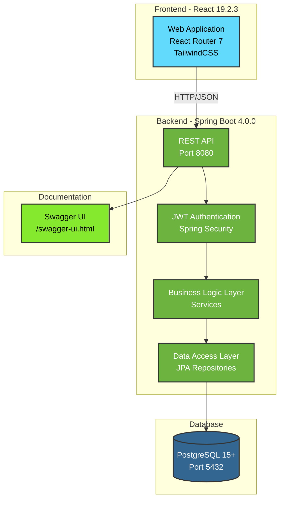
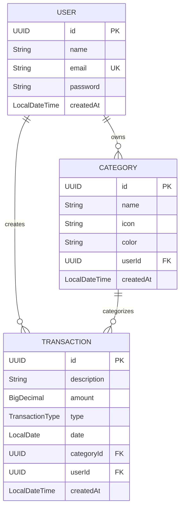

# Penny API - Gerenciador de Finanças Pessoais

<!-- Language toggles -->
[](README.md)
[](README.en.md)

<!-- Badges -->


## 📖 Sobre o Projeto

Penny API é uma aplicação full-stack para gerenciamento de finanças pessoais, permitindo aos usuários controlar receitas, despesas e categorias de forma segura e intuitiva.

## ✨ Funcionalidades

- 🔐 Autenticação e autorização com JWT
- 👤 Cadastro e gerenciamento de usuários
- 📁 CRUD completo de categorias personalizadas
  - Ícones e cores customizáveis
  - Isolamento por usuário
- 💰 Gerenciamento de transações financeiras
  - Tipos: Receitas e Despesas
  - Paginação e filtragem
  - Associação com categorias
- 📊 Dashboard financeiro
  - Total de receitas
  - Total de despesas
  - Saldo atual
- 🛡️ Tratamento global de exceções
- 📚 Documentação interativa com Swagger
- ✅ Testes automatizados (unitários e integração)

## 🛠️ Stack Tecnológica

### Backend
- **Java 21** - Linguagem de programação
- **Spring Boot 4.0.0** - Framework principal
  - Spring Web MVC - API REST
  - Spring Data JPA - Persistência de dados
  - Spring Security - Autenticação e autorização
- **PostgreSQL 15+** - Banco de dados relacional
- **Auth0 java-jwt 4.4.0** - Tokens JWT
- **Gradle 9.2.1** - Build tool

### Frontend
- **React 19.2.3** - Biblioteca UI
- **React Router 7.10.1** - Roteamento
- **TypeScript 5.9.2** - Type safety
- **TailwindCSS 4.1.13** - Framework CSS
- **Vite 7.1.7** - Build tool

### Testes e Qualidade
- **JUnit 5** - Framework de testes
- **TestContainers 1.20.4** - Testes de integração
- **JaCoCo**

### Documentação
- **SpringDoc OpenAPI 3.0.0** - Documentação API
- **Swagger UI** - Interface interativa

## 🏗️ Arquitetura



## 📊 Modelo de Dados



## 📋 Pré-requisitos

Antes de começar, certifique-se de ter instalado:

- **Java 21** - [Download OpenJDK 21](https://adoptium.net/)
- **PostgreSQL 15+** - [Download PostgreSQL](https://www.postgresql.org/download/)
- **Node.js 18+** e **npm** - [Download Node.js](https://nodejs.org/)
- **Git** - [Download Git](https://git-scm.com/)

### Verificando Instalações

```bash
java -version    # Deve mostrar Java 21
psql --version   # Deve mostrar PostgreSQL 15+
node -version    # Deve mostrar Node.js 18+
npm -version     # Verifica instalação do npm
```

## 🚀 Instalação

### 1. Clone o Repositório

```bash
git clone https://github.com/vittordeaguiar/penny-api.git
cd penny-api
```

### 2. Configuração do Banco de Dados

```bash
# Acesse o PostgreSQL
psql -U postgres

# Crie o banco de dados
CREATE DATABASE penny_db;

# Crie um usuário (opcional)
CREATE USER penny_user WITH PASSWORD 'your_password';
GRANT ALL PRIVILEGES ON DATABASE penny_db TO penny_user;

# Saia do PostgreSQL
\q
```

### 3. Configuração do Backend

```bash
# Navegue até o diretório da API
cd api

# Configure as variáveis de ambiente (opcional)
export JWT_SECRET="your-secret-key-here"
export JWT_EXPIRATION=3600000

# Se criou um usuário específico, atualize application.properties:
# src/main/resources/application.properties
# spring.datasource.username=penny_user
# spring.datasource.password=your_password

# Execute os testes para verificar
./gradlew test

# Compile o projeto
./gradlew build
```

### 4. Configuração do Frontend

```bash
# Navegue até o diretório web
cd ../web

# Instale as dependências
npm install
```

## Executando a Aplicação

### Backend (API)

```bash
# A partir do diretório raiz do projeto
cd api
./gradlew bootRun
```

A API estará disponível em: `http://localhost:8080`

### Frontend (Web)

Em um novo terminal:

```bash
# A partir do diretório raiz do projeto
cd web
npm run dev
```

A aplicação web estará disponível em: `http://localhost:5173`

### Acessando a Aplicação

- **Aplicação Web**: http://localhost:5173
- **API REST**: http://localhost:8080
- **Documentação Swagger**: http://localhost:8080/swagger-ui.html
- **API Docs (JSON)**: http://localhost:8080/v3/api-docs

### Primeira Execução

1. Acesse http://localhost:5173
2. Crie uma nova conta através do registro
3. Faça login com suas credenciais
4. Comece a gerenciar suas finanças!

## Executando Testes

O projeto possui uma suíte completa de testes com **80% de cobertura mínima**.

### Testes Unitários e de Integração

```bash
# A partir do diretório api
cd api

# Executar todos os testes
./gradlew test

# Executar apenas testes unitários
./gradlew test --tests "com.vittor.pennyapi.service.*"

# Executar apenas testes de integração
./gradlew test --tests "com.vittor.pennyapi.integration.*"
```

### Relatório de Cobertura

```bash
# Gerar relatório JaCoCo
./gradlew jacocoTestReport

# O relatório HTML será gerado em:
# build/jacocoHtml/index.html
```

### Verificação de Cobertura

```bash
# Verificar se a cobertura atende aos requisitos (80%)
./gradlew jacocoTestCoverageVerification
```

### Estrutura de Testes

```
api/src/test/java/com/vittor/pennyapi/
├── integration/          # 6 testes de integração (TestContainers)
│   ├── AuthenticationIntegrationTest.java
│   ├── CategoryIntegrationTest.java
│   ├── TransactionValidationIntegrationTest.java
│   ├── UserJourneyIntegrationTest.java
│   └── ...
├── service/              # 3 testes unitários (service layer)
│   ├── CategoryServiceTest.java
│   ├── TransactionServiceTest.java
│   └── UserServiceTest.java
└── security/             # Testes de segurança
    └── TokenServiceTest.java
```

## Variáveis de Ambiente

| Variável | Descrição | Valor Padrão | Obrigatória |
|----------|-----------|--------------|-------------|
| `JWT_SECRET` | Chave secreta para tokens JWT | `22c22bc4d641b1b5` | Não* |
| `JWT_EXPIRATION` | Tempo de expiração do token (ms) | `3600000` (1 hora) | Não |
| `SPRING_DATASOURCE_URL` | URL de conexão PostgreSQL | `jdbc:postgresql://localhost:5432/penny_db` | Não |
| `SPRING_DATASOURCE_USERNAME` | Usuário do banco | `vittordeaguiar` | Não |
| `SPRING_DATASOURCE_PASSWORD` | Senha do banco | *(vazio)* | Não |

**\* Importante**: Em produção, **sempre configure um JWT_SECRET customizado e seguro!**

### Configurando Variáveis

**Linux/macOS:**
```bash
export JWT_SECRET="your-very-secure-secret-key-here"
export JWT_EXPIRATION=7200000
```

**Windows (PowerShell):**
```powershell
$env:JWT_SECRET="your-very-secure-secret-key-here"
$env:JWT_EXPIRATION=7200000
```

## 📁 Estrutura do Projeto

```
penny-api/
├── api/                          # Backend Spring Boot
│   ├── src/
│   │   ├── main/
│   │   │   ├── java/com/vittor/pennyapi/
│   │   │   │   ├── config/       # Configurações (Security, Swagger)
│   │   │   │   ├── controller/   # REST Controllers
│   │   │   │   │   ├── AuthController.java
│   │   │   │   │   ├── CategoryController.java
│   │   │   │   │   └── TransactionController.java
│   │   │   │   ├── dto/          # Data Transfer Objects
│   │   │   │   ├── entity/       # Entidades JPA
│   │   │   │   │   ├── User.java
│   │   │   │   │   ├── Category.java
│   │   │   │   │   └── Transaction.java
│   │   │   │   ├── enums/        # Enumerações (TransactionType)
│   │   │   │   ├── exception/    # Exception handlers
│   │   │   │   ├── repository/   # JPA Repositories
│   │   │   │   ├── security/     # JWT & Security filters
│   │   │   │   └── service/      # Lógica de negócio
│   │   │   └── resources/
│   │   │       └── application.properties
│   │   └── test/                 # Testes (9 classes)
│   ├── build.gradle
│   └── gradlew
│
├── web/                          # Frontend React
│   ├── app/                      # Código da aplicação
│   ├── public/                   # Assets estáticos
│   ├── package.json
│   └── vite.config.ts
│
├── ROADMAP.md                    # Planejamento do projeto
└── README.md                     # Este arquivo
```

## Documentação da API

A documentação completa da API está disponível via **Swagger UI**.

### Acessando o Swagger

Com a aplicação rodando, acesse:
- **Interface Interativa**: http://localhost:8080/swagger-ui.html
- **Documentação JSON**: http://localhost:8080/v3/api-docs

### Principais Endpoints

#### Autenticação
- `POST /api/auth/register` - Registrar novo usuário
- `POST /api/auth/login` - Login e obtenção de token JWT

#### Categorias
- `GET /api/categories` - Listar categorias do usuário
- `POST /api/categories` - Criar nova categoria
- `GET /api/categories/{id}` - Obter categoria específica
- `PUT /api/categories/{id}` - Atualizar categoria
- `DELETE /api/categories/{id}` - Deletar categoria

#### Transações
- `GET /api/transactions` - Listar transações (paginado)
- `POST /api/transactions` - Criar nova transação
- `GET /api/transactions/{id}` - Obter transação específica
- `PUT /api/transactions/{id}` - Atualizar transação
- `DELETE /api/transactions/{id}` - Deletar transação
- `GET /api/transactions/summary` - Resumo financeiro (dashboard)

### Autenticação

Todos os endpoints (exceto registro e login) requerem autenticação JWT.

**Header necessário:**
```
Authorization: Bearer {seu-token-jwt}
```

**Exemplo com curl:**
```bash
# 1. Registrar usuário
curl -X POST http://localhost:8080/api/auth/register \
  -H "Content-Type: application/json" \
  -d '{"name":"João Silva","email":"joao@example.com","password":"senha123"}'

# 2. Login
curl -X POST http://localhost:8080/api/auth/login \
  -H "Content-Type: application/json" \
  -d '{"email":"joao@example.com","password":"senha123"}'

# 3. Usar o token para acessar endpoints protegidos
curl -X GET http://localhost:8080/api/categories \
  -H "Authorization: Bearer {token-retornado}"
```

## Contribuindo

Contribuições são bem-vindas! Para contribuir:

1. Fork o projeto
2. Crie uma branch para sua feature (`git checkout -b feature/MinhaFeature`)
3. Commit suas mudanças (`git commit -m 'Adiciona MinhaFeature'`)
4. Push para a branch (`git push origin feature/MinhaFeature`)
5. Abra um Pull Request

### Padrões de Código

- Siga as convenções do Java (Google Java Style Guide)
- Mantenha a cobertura de testes acima de 80%
- Documente novos endpoints no Swagger
- Escreva mensagens de commit descritivas

## Contato

**Vittor de Aguiar**
- GitHub: [@vittordeaguiar](https://github.com/vittordeaguiar)
- LinkedIn: [@vittordeaguiar](https://www.linkedin.com/in/vittordeaguiar/)
